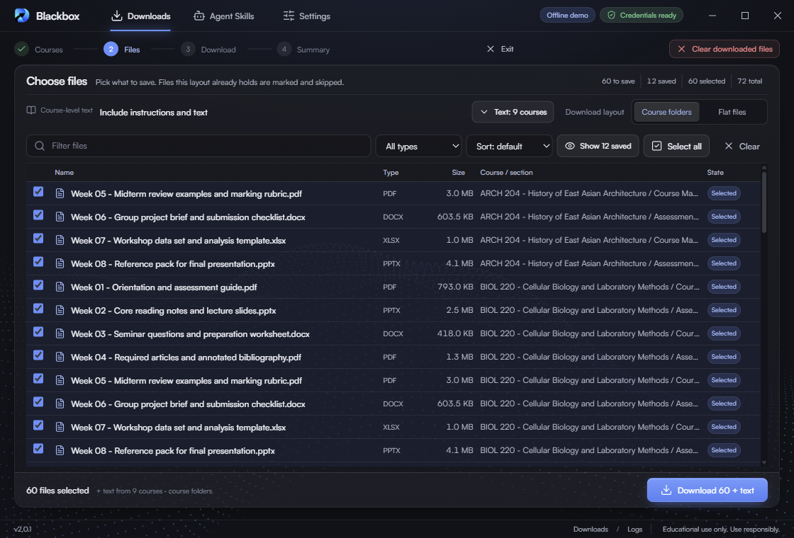
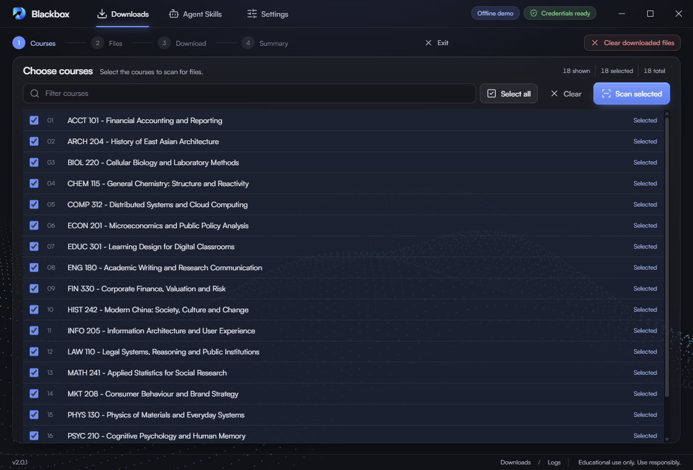
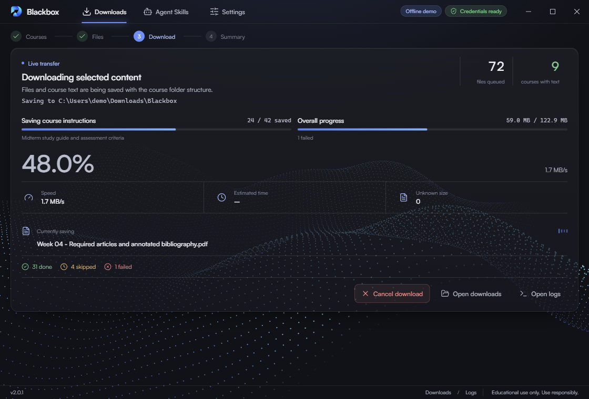
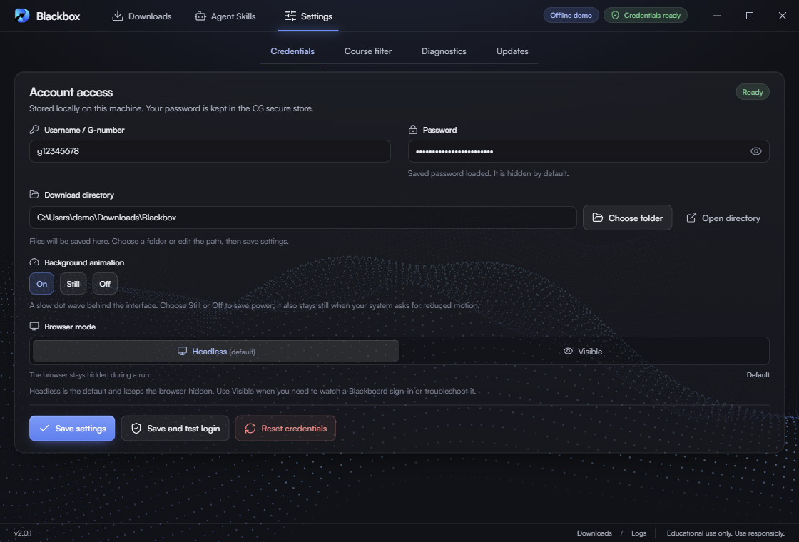

# Blackbox

A small Windows app that downloads your course documents from BlackboardChina. Pick courses, pick files, save them. It only reads Blackboard; it never submits coursework or changes anything.



## Install

1. Download `Blackbox_<version>_x64-setup.exe` from [GitHub Releases](https://github.com/Panther114/blackbox/releases) and run it (about 2 MB).
2. Open **Settings → Credentials**, enter your username and password, choose a download folder and save. The password is kept in the Windows secure store.

Requires Windows 10 or 11 (WebView2, included with Windows).

## Use

1. **Downloads → Start a download** signs in and lists your courses.
2. Select courses and **Scan selected**. Cancel or **Exit** at any point before the transfer starts.
3. Choose files, optionally include each course's text (saved as Markdown), pick **Course folders** or **Flat files**, and download. **Cancel download** stops it and keeps what is already saved.

| Choose courses | Download |
| --- | --- |
|  |  |

Files already saved in the chosen layout are marked *Saved* and skipped. Only `pdf`, `ppt(x)`, `doc(x)` and `xls(x)` are saved; archives, images, media and other types are rejected.

Other tabs: **Agent Skills** exports course text and attachments read-only for coding agents. **Settings** has course filters, diagnostics and updates.



**Headless** (default) signs in without a window. If sign-in fails, switch to **Visible** to watch what Blackboard asks for.

After each run, find `logs/blackbox.log` and `logs/latest-summary.txt` (open them from the footer) and `blackbox-run-report.json` in your download folder. See [TROUBLESHOOTING.md](TROUBLESHOOTING.md) for common problems.

## Development

Requires Node.js 22+, Rust, and the Windows WebView2 runtime.

```bash
npm install
npm test                  # unit tests
(cd src-tauri && cargo test --lib)
npm run tauri:build       # NSIS installer in src-tauri/target/release/bundle/nsis
```

Screenshots use offline fixture data: `node scripts/tauri-capture.mjs <blackbox.exe> <screen> out.png 1120x760` (screens such as `courses`, `files`, `download`, `credentials`). Releases are built by GitHub Actions when a `v*` tag is pushed; see [CHANGELOG.md](CHANGELOG.md).

## Disclaimer

Provided for educational, personal and technical purposes only. You are solely responsible for making sure your use complies with SHSID policies, platform terms and applicable law. The developer does not endorse or authorize misuse and disclaims all liability for it and its consequences, to the maximum extent permitted by law.
